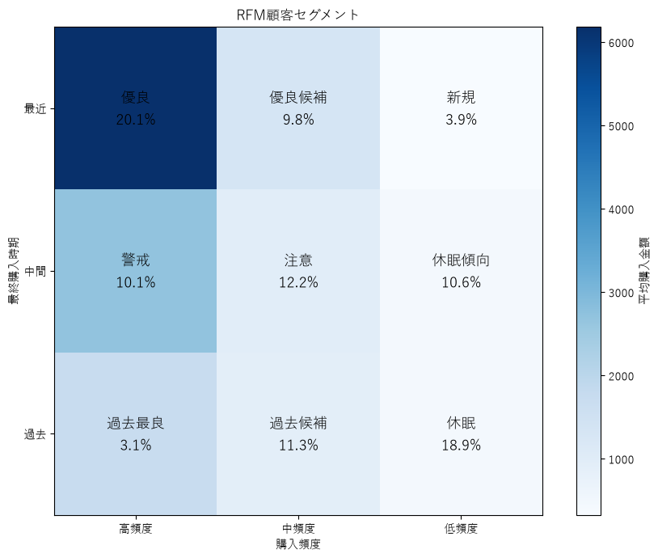
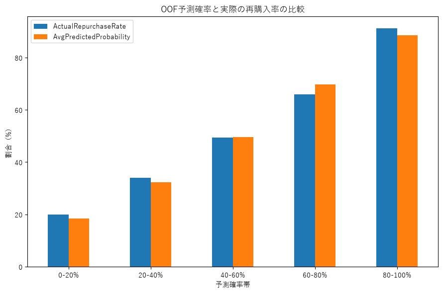
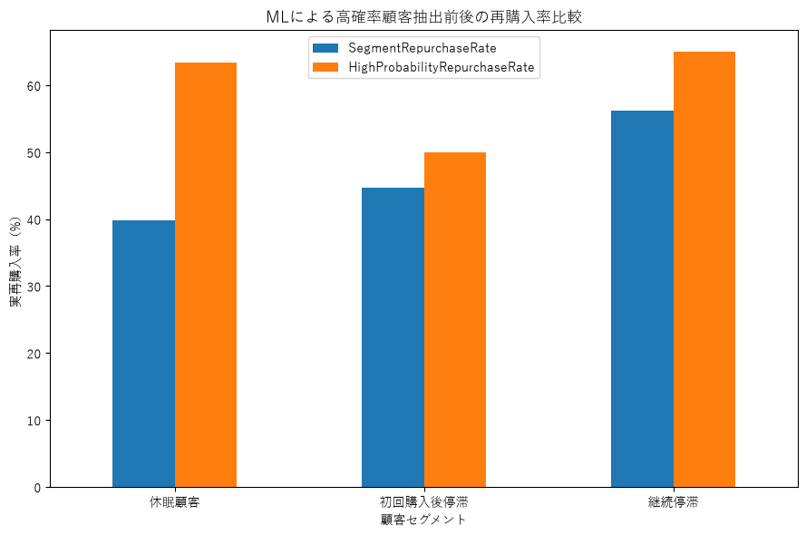

# EC購買データを用いた顧客セグメント分析と再購入予測  

## 概要  
UCI Online Retailデータを用いて、RFM分析による顧客セグメンテーションと90日以内の再購入予測を行った。さらにRFMセグメントと機械学習による再購入確率を組み合わせ、同一セグメント内から再購入可能性の高い顧客を抽出した。最終モデルにはLogistic Regressionを採用し、5-fold CVでROC-AUC 0.746を得た。特に休眠顧客では、全体の7.81%に対象を絞ることで実再購入率が39.84%から63.33%へ上昇し、Lift 1.59となった。  

## 分析の目的

本分析では、EC購買履歴から顧客の購買行動を把握し、再購入につながる特徴を明らかにすることを目的とした。

具体的には、以下の3点に取り組んだ。

1. RFM分析による顧客セグメンテーション
2. 過去の購買履歴を用いた90日以内の再購入予測
3. RFMセグメントと再購入予測確率を組み合わせたターゲティング

特に、RFMだけでは同一セグメントとなる顧客を、機械学習によってさらに細分化し、再購入可能性の高い顧客を抽出できるかを検証した。

## 使用データ

UCI Machine Learning Repository の Online Retail データセットを使用した。

英国のオンライン小売企業における2010年12月から2011年12月までの取引データであり、主に以下の情報が含まれている。

- InvoiceNo：注文番号
- StockCode：商品コード
- Description：商品名
- Quantity：購入数量
- InvoiceDate：購入日時
- UnitPrice：単価
- CustomerID：顧客ID
- Country：国

分析前に以下の前処理を行った。

- CustomerIDが欠損しているレコードを除外
- キャンセル取引を除外
- Quantity <= 0 のレコードを除外
- UnitPrice <= 0 のレコードを除外
- Quantity × UnitPrice から購入金額 `TotalPrice` を算出

## 使用技術

- Python
- pandas
- NumPy
- matplotlib
- scikit-learn
- Jupyter Notebook

主に以下の手法を使用した。

- RFM分析
- Logistic Regression
- Random Forest
- 5-fold Cross Validation
- 特徴量エンジニアリング
- Permutation Importance
- Out-of-Fold予測
- ROC-AUC / Accuracy / Precision / Recall / F1 / Brier Score による評価

## 分析の流れ

1. データの確認・前処理
2. RFM指標の作成
3. R×Fによる9種類の顧客セグメント作成
4. セグメントごとの顧客数・購買傾向を分析
5. 基準日以前の購買履歴から特徴量を作成
6. 基準日以降90日以内の再購入有無を目的変数として定義
7. Logistic Regression / Random Forest を比較
8. log変換・追加特徴量による特徴量エンジニアリング
9. 5-fold CVによるモデル・特徴量選択
10. 最終モデルの係数・オッズ比を解釈
11. OOF予測による再購入確率の検証
12. RFMセグメントと再購入確率を組み合わせてターゲティング対象を分析

## 主な結果

- 最終モデルには Logistic Regression を採用
- 最終特徴量は以下の4つ
  - Recency
  - log(Frequency + 1)
  - log(Monetary + 1)
  - log(UniqueProducts + 1)
- 5-fold Cross Validation における ROC-AUC は **0.746**
- Random Forest の ROC-AUC は **0.711** であり、Logistic Regression の方が高性能かつ安定していた
- `UniqueProducts` を追加することで、RFMのみのモデルよりROC-AUCが改善した
- 最終モデルでは Frequency が再購入と最も強い正の関連を示した
- OOF予測では、予測確率が高くなるほど実際の再購入率も上昇した
- 休眠顧客では、全体384人のうち30人（7.81%）に対象を絞ることで、
  実再購入率が **39.84% → 63.33%** に上昇し、Liftは **1.59**
- 継続停滞顧客では、40.27%を対象とすることで実際の再購入者の **46.61%** を捕捉できた

## RFM分析

顧客ごとに以下のRFM指標を算出した。

- **Recency**：最終購入からの経過日数
- **Frequency**：注文回数
- **Monetary**：累計購入金額

RecencyとFrequencyを3段階にスコア化し、R×Fの組み合わせから9種類の顧客セグメントを作成した。
Monetaryはセグメント分類には使用せず、各セグメントの顧客価値を確認する指標として利用した。

分析の結果、優良顧客が全体の約20%を占める一方、
初回購入後に継続購入していない顧客も一定数存在しており、
再購入促進が重要な課題であることが確認できた。

## 再購入予測

予測基準日以前の購買履歴から特徴量を作成し、
基準日以降約90日以内に再購入したかどうかを目的変数とした。

まずRFMを用いてLogistic RegressionとRandom Forestを比較し、
さらに特徴量エンジニアリングを行った。

追加特徴量として以下を検証した。

- UniqueProducts：購入した商品種類数
- PurchaseDays：購入した日数
- CustomerAge：観測期間内の初回購入からの経過日数
- AvgOrderValue：1注文あたり平均購入金額

1特徴量ずつ5-fold CVで評価した結果、
`UniqueProducts`のみが安定した性能改善を示したため、最終特徴量として採用した。

### 最終モデル比較

| Model | Accuracy | Precision | Recall | F1 | ROC-AUC |
|---|---:|---:|---:|---:|---:|
| Logistic Regression | 0.680 | 0.719 | 0.720 | 0.719 | **0.746** |
| Random Forest | 0.653 | 0.692 | 0.706 | 0.699 | 0.711 |

最終的に、性能と解釈性の両面からLogistic Regressionを採用した。

モデル係数の分析では、Frequencyが再購入と最も強い正の関連を示し、
UniqueProductsも正の関連、Recencyは負の関連を示した。

## ターゲティング分析

最終モデルのOut-of-Fold予測確率をRFMセグメントと組み合わせ、
同一セグメント内で再購入可能性の高い顧客を抽出した。

OOF予測では、予測確率が高くなるほど実際の再購入率も段階的に上昇し、
モデルが顧客の再購入可能性を順位付けできていることを確認した。

特に休眠顧客では、384人のうち再購入確率60%以上の30人を抽出すると、

- 対象率：**7.81%**
- セグメント全体の再購入率：**39.84%**
- 高確率層の再購入率：**63.33%**
- Lift：**1.59**

となった。

また継続停滞顧客では、

- 対象率：**40.27%**
- 高確率層の再購入率：**65.00%**
- 実際の再購入者の捕捉率：**46.61%**

となった。

この結果から、休眠顧客では少数の有望顧客を効率的に抽出し、
継続停滞顧客ではより広い再購入候補をカバーする、
という使い分けが可能であると考えられる。

ただし、再購入確率が高いことは施策による再購入効果が高いことを意味しない。
本分析は顧客の再購入可能性を予測したものであり、
マーケティング施策の因果効果を推定したものではない。

## 分析上の限界  

## ファイル構成  

## 実行方法  

